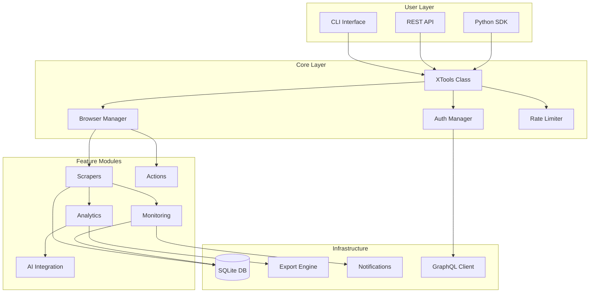
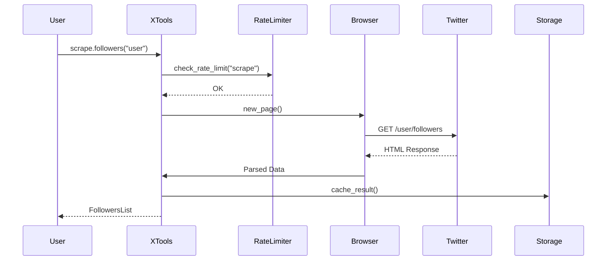

# Architecture Overview

Understanding XTools' internal architecture helps you extend, customize, and optimize it for your use cases.

## System Architecture



## Component Overview

### Core Components

#### XTools Class

The main entry point that orchestrates all functionality:

```python
from xtools import XTools

async with XTools(
    headless=True,
    proxy="http://proxy:8080",
    rate_limit_profile="conservative"
) as x:
    # All features accessible via x.*
    pass
```

**Responsibilities:**
- Lifecycle management (browser startup/shutdown)
- Dependency injection
- Configuration management
- Error handling and recovery

#### Browser Manager

Manages Playwright browser instances:

```python
from xtools.core.browser import BrowserManager

class BrowserManager:
    """
    Handles browser lifecycle and page management.
    
    Features:
    - Connection pooling
    - Page recycling
    - Stealth mode integration
    - Proxy rotation
    """
    
    async def new_page(self) -> Page:
        """Get a configured page with stealth settings."""
        
    async def close(self):
        """Clean shutdown of all browser resources."""
```

#### Auth Manager

Handles authentication and session management:

```python
from xtools.core.auth import AuthManager

class AuthManager:
    """
    Cookie-based authentication.
    
    Features:
    - Save/load sessions
    - Cookie validation
    - Token extraction for GraphQL
    - Multi-account support
    """
```

#### Rate Limiter

Protects accounts with intelligent rate limiting:

```python
from xtools.core.rate_limiter import RateLimiter

class RateLimiter:
    """
    Adaptive rate limiting based on action types.
    
    Profiles:
    - aggressive: Maximum speed (risky)
    - normal: Balanced approach
    - conservative: Safest option
    - stealth: Mimics human behavior
    """
```

### Feature Modules

#### Scrapers Architecture

All scrapers inherit from `BaseScraper`:

```python
from xtools.scrapers.base import BaseScraper

class BaseScraper:
    """Base class for all scrapers."""
    
    async def scrape(self, **kwargs) -> ScrapeResult:
        """Main scraping method."""
        
    async def _extract_data(self, page: Page) -> List[dict]:
        """Override to extract specific data."""
        
    async def _handle_pagination(self, page: Page) -> Optional[str]:
        """Handle infinite scroll or pagination."""
```

**Scraper Hierarchy:**

```
BaseScraper
├── RepliesScraper
├── ProfileScraper
├── FollowersScraper
├── FollowingScraper
├── TweetsScraper
├── ThreadScraper
├── SearchScraper
├── HashtagScraper
├── MediaScraper
├── LikesScraper
├── ListsScraper
├── MentionsScraper
├── SpacesScraper
├── MediaDownloader
└── RecommendationsScraper
```

#### Actions Architecture

Actions perform mutations on Twitter:

```python
from xtools.actions.base import BaseAction

class BaseAction:
    """Base class for all actions."""
    
    async def execute(self, **kwargs) -> ActionResult:
        """Execute the action with rate limiting."""
        
    async def _pre_action(self):
        """Setup before action (rate limit check)."""
        
    async def _post_action(self):
        """Cleanup after action (logging, delays)."""
```

### Data Flow



## Plugin System

XTools supports plugins for extending functionality:

```python
from xtools.plugins import Plugin, hook

class MyPlugin(Plugin):
    """Custom plugin example."""
    
    name = "my-plugin"
    version = "1.0.0"
    
    @hook("before_scrape")
    async def on_before_scrape(self, scraper, **kwargs):
        """Called before any scrape operation."""
        print(f"Starting scrape: {scraper.__class__.__name__}")
    
    @hook("after_action")
    async def on_after_action(self, action, result):
        """Called after any action completes."""
        await self.log_action(action, result)

# Register plugin
x.plugins.register(MyPlugin())
```

### Available Hooks

| Hook | Description | Arguments |
|------|-------------|-----------|
| `before_scrape` | Before scraping starts | scraper, kwargs |
| `after_scrape` | After scraping completes | scraper, result |
| `before_action` | Before action executes | action, kwargs |
| `after_action` | After action completes | action, result |
| `on_error` | When an error occurs | error, context |
| `on_rate_limit` | Rate limit triggered | limiter, action |

## Configuration System

XTools uses a layered configuration system:

```
Priority (highest to lowest):
1. Runtime arguments
2. Environment variables
3. Config file (~/.xtools/config.yaml)
4. Default values
```

```yaml
# ~/.xtools/config.yaml
browser:
  headless: true
  timeout: 30000
  user_agent: "Mozilla/5.0..."

rate_limiting:
  profile: conservative
  custom_delays:
    follow: [5, 10]
    like: [2, 5]

proxy:
  enabled: true
  rotation: round_robin
  list:
    - http://proxy1:8080
    - http://proxy2:8080

storage:
  database: sqlite:///~/.xtools/data.db
  cache_ttl: 3600

notifications:
  discord_webhook: ${DISCORD_WEBHOOK}
  telegram_bot_token: ${TELEGRAM_TOKEN}
```

## Error Handling

XTools implements a hierarchical error system:

```python
from xtools.exceptions import (
    XToolsError,           # Base exception
    AuthenticationError,   # Login/session issues
    RateLimitError,        # Rate limit exceeded
    NetworkError,          # Connection issues
    ScrapingError,         # Data extraction failed
    ActionError,           # Action failed
    ValidationError,       # Invalid input
)

# Custom error handling
try:
    await x.follow.user("username")
except RateLimitError as e:
    print(f"Rate limited. Wait {e.retry_after} seconds")
except AuthenticationError:
    await x.auth.refresh_session()
except XToolsError as e:
    print(f"XTools error: {e}")
```

## Memory Management

XTools optimizes memory for large-scale operations:

```python
# Streaming mode for large datasets
async for batch in x.scrape.followers("user", batch_size=100):
    process(batch)
    # Memory released after each batch

# Manual cache control
x.cache.clear()
x.cache.set_max_size(1000)  # Max cached items
```

## Concurrency Model

XTools uses asyncio for concurrent operations:

```python
import asyncio

# Parallel scraping (different users)
async def scrape_multiple():
    tasks = [
        x.scrape.profile("user1"),
        x.scrape.profile("user2"),
        x.scrape.profile("user3"),
    ]
    results = await asyncio.gather(*tasks)
    return results

# Sequential with batching (same resource)
async def follow_users(users: list):
    for user in users:
        await x.follow.user(user)
        # Rate limiter handles delays
```

## Best Practices

### 1. Always Use Context Manager

```python
# ✅ Good
async with XTools() as x:
    await x.scrape.profile("user")

# ❌ Bad - resources may leak
x = XTools()
await x.scrape.profile("user")
# Browser never closed!
```

### 2. Handle Errors Gracefully

```python
# ✅ Good
try:
    result = await x.scrape.followers("user", limit=1000)
except RateLimitError:
    await asyncio.sleep(900)  # Wait 15 minutes
    result = await x.scrape.followers("user", limit=1000)
```

### 3. Use Appropriate Rate Limit Profiles

```python
# For important accounts
async with XTools(rate_limit_profile="conservative") as x:
    pass

# For disposable/test accounts
async with XTools(rate_limit_profile="aggressive") as x:
    pass
```

## Next Steps

- [Custom Scrapers](custom-scrapers.md) - Build your own scrapers
- [Plugins](plugins.md) - Extend XTools functionality
- [Performance](performance.md) - Optimize for scale
- [Distributed](distributed.md) - Multi-machine setups
