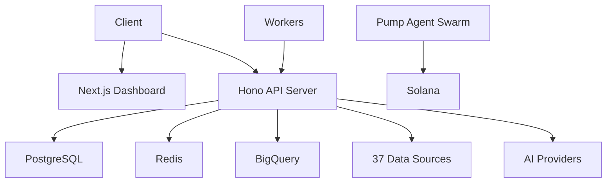

# Prompt 25 — Documentation, API Spec & Developer Experience

## Context

You are finalizing documentation for crypto-vision, a full-stack TypeScript crypto data platform. The project has:

- **200+ API endpoints** across 39 route modules
- **37 data source adapters**
- **15 background workers**
- **43 AI agent definitions**
- **6 packages** (mcp-server, binance-mcp, bnbchain-mcp, agent-runtime, pump-agent-swarm, ucai)
- **Next.js dashboard** with 55+ pages
- **Existing docs** in `docs/` (20+ files, some stale)
- **OpenAPI specs** — `openapi.yaml` (root), plus specs in apps/dashboard, apps/news, packages/sweep

Key doc files:
```
docs/
├── AGENTS.md
├── ANOMALY_DETECTION.md
├── API_AUTHENTICATION.md
├── API_REFERENCE.md
├── ARCHITECTURE.md
├── COINGECKO_RATE_LIMITING.md
├── CONFIGURATION.md
├── DATA_PIPELINE.md
├── DATA_SOURCES.md
├── DATABASE.md
├── DEPLOYMENT.md
├── DEVELOPER_WORKFLOW.md
├── INFRASTRUCTURE.md
├── ML_TRAINING.md
├── MONITORING.md
├── PACKAGES.md
├── PERFORMANCE.md
├── REPOSITORY_GUIDE.md
├── SECURITY_GUIDE.md
├── SELF_HOSTING.md
├── TELEGRAM_BOT.md
├── TESTING.md
├── TROUBLESHOOTING.md
├── WEBSOCKET.md
└── X402_PAYMENTS.md
README.md
SECURITY.md
CONTRIBUTING.md
CHANGELOG.md
```

## Task

### 1. Update `openapi.yaml` (Root API Spec)

Regenerate the complete OpenAPI 3.1 specification from the actual route handlers:

```yaml
openapi: 3.1.0
info:
  title: Crypto Vision API
  version: 2.0.0
  description: Comprehensive cryptocurrency data and intelligence API
  license:
    name: MIT
  contact:
    name: nirholas
    url: https://github.com/nirholas/crypto-vision

servers:
  - url: http://localhost:8080
    description: Development
  - url: https://api.cryptovision.dev
    description: Production

security:
  - apiKey: []

paths:
  # Generate from ALL 39 route modules:
  # src/routes/bitcoin.ts, src/routes/market.ts, src/routes/defi.ts, etc.
  # Every endpoint must have:
  #   - Summary and description
  #   - Parameters (query, path, header) with schemas
  #   - Request body schema (if applicable)
  #   - Response schemas for 200, 400, 401, 429, 500
  #   - Tags for grouping
  #   - Examples

components:
  securitySchemes:
    apiKey:
      type: apiKey
      in: header
      name: X-API-Key
  schemas:
    # All response types defined here
    Error:
      type: object
      properties:
        error: { type: string }
        message: { type: string }
        code: { type: integer }
```

**Method: Read every route file in `src/routes/`, extract all handlers, and generate matching OpenAPI paths.**

### 2. Update `README.md`

Rewrite the root README to accurately reflect the current project:

```markdown
# Crypto Vision

## Overview
Brief description of what the project does

## Architecture
High-level architecture diagram (Mermaid)
- API Server (Hono, Node.js 22)
- Dashboard (Next.js 15)
- Workers (background data collection)
- Database (PostgreSQL 16, Redis 7, BigQuery)
- AI/ML (multi-provider, fine-tuned models)
- MCP Servers (Claude, ChatGPT integration)
- Pump Agent Swarm (autonomous Solana agents)

## Quick Start
docker-compose up # Full stack
npm run dev       # API server only

## Project Structure
Accurate tree of all packages and apps

## API Reference
Link to docs/API_REFERENCE.md and openapi.yaml

## Packages
Table of all packages with description and status

## Configuration
Required environment variables with descriptions

## Contributing
Link to CONTRIBUTING.md

## License
MIT
```

### 3. Update `docs/API_REFERENCE.md`

Complete API reference organized by category:

```markdown
# API Reference

## Authentication
How to obtain and use API keys

## Rate Limiting
Tiers, limits, headers

## Endpoints

### Bitcoin & Crypto Prices
GET /api/bitcoin/price
GET /api/bitcoin/history
...

### Market Data
GET /api/market/overview
GET /api/market/trending
...

### DeFi
GET /api/defi/tvl
GET /api/defi/yields
...

# (ALL 200+ endpoints documented)

## WebSocket
Connection, channels, message format

## Error Handling
Error response format, common error codes
```

### 4. Update `docs/ARCHITECTURE.md`

Create an accurate architecture doc with Mermaid diagrams:

```markdown
# Architecture

## System Overview


## Data Flow
## Request Lifecycle
## Worker Pipeline
## AI/ML Pipeline
## Authentication Flow
## WebSocket Architecture
```

### 5. Update `docs/PACKAGES.md`

Document all packages:

| Package | Description | Status | Docs |
|---------|-------------|--------|------|
| mcp-server | MCP tools for AI assistants | ⚠️ Partial | [README](../packages/mcp-server/README.md) |
| binance-mcp | Binance trading MCP server | ⚠️ Partial | [README](../packages/binance-mcp/README.md) |
| bnbchain-mcp | BNB Chain MCP server | ⚠️ Partial | [README](../packages/bnbchain-mcp/README.md) |
| agent-runtime | ERC-8004 agent runtime | 🚧 WIP | [README](../packages/agent-runtime/README.md) |
| pump-agent-swarm | Autonomous Solana trading agents | 🚧 WIP | [README](../packages/pump-agent-swarm/README.md) |
| ucai | Python ML utilities | 🚧 WIP | [README](../packages/ucai/README.md) |
| market-data | Market data SDK | ✅ | [README](../packages/market-data/README.md) |
| sweep | Code sweep utility | ✅ | [README](../packages/sweep/README.md) |

### 6. Update `docs/CONFIGURATION.md`

Document every environment variable:

```markdown
# Configuration

## Required Variables
| Variable | Description | Default | Required |
|----------|-------------|---------|----------|
| DATABASE_URL | PostgreSQL connection string | — | Yes |
| REDIS_URL | Redis connection string | redis://localhost:6379 | Yes |
| COINGECKO_API_KEY | CoinGecko API key | — | No (free tier) |
...

## Optional Variables
## Per-Package Variables
## Docker Compose Variables
## GCP/Infrastructure Variables
```

### 7. Update `docs/DEVELOPER_WORKFLOW.md`

```markdown
# Developer Workflow

## Setup
git clone, npm install, docker-compose up

## Development
npm run dev — starts API server with hot reload
cd apps/dashboard && npm run dev — starts dashboard

## Testing
npm test — unit tests
npm run test:e2e — end-to-end tests
npm run test:integration — integration tests

## Code Quality
npm run lint
npm run typecheck

## Git Conventions
Commits as nirholas
Branch naming: feature/, fix/, docs/

## Debugging
Common issues and solutions
```

### 8. Update Stale Docs

Review every file in `docs/` and:
- Remove references to deleted features
- Update file paths that changed
- Add cross-references between related docs
- Fix broken links
- Update version numbers
- Add "Last Updated" timestamps

### 9. Generate CHANGELOG.md

Update the root CHANGELOG with all recent changes:

```markdown
# Changelog

## [Unreleased]
### Added
- 25 agent prompts for project completion
- Pump agent swarm package
- MCP server with 24 tool modules
- Agent runtime (ERC-8004)
- ...

### Changed
- Dashboard redesign (trading terminal focus)
- ...

### Fixed
- ...
```

### 10. Package READMEs

Ensure every package has a comprehensive README:
- `packages/pump-agent-swarm/README.md` — Install, config, usage, API, agents
- `packages/mcp-server/README.md` — Tools list, setup, usage with Claude/ChatGPT
- `packages/agent-runtime/README.md` — ERC-8004, A2A, x402 setup
- `packages/binance-mcp/README.md` — Setup, API key config, tools
- `packages/bnbchain-mcp/README.md` — Setup, tools, BSC integration

## Verification

1. `openapi.yaml` validates: `npx @redocly/cli lint openapi.yaml`
2. All internal doc links resolve (no broken links)
3. README accurately describes current project structure
4. Every environment variable in `.env.example` is documented
5. Every package has a complete README
6. Architecture diagrams render correctly in GitHub Markdown
7. API reference covers all 200+ endpoints
8. No references to deleted features or stale file paths
